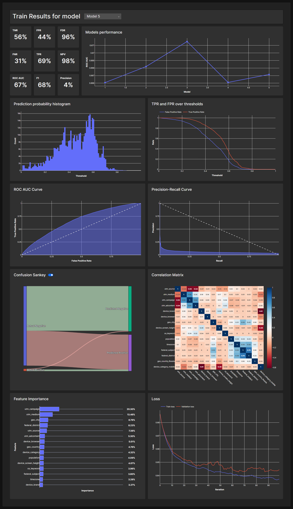

# Sber Avtopodpiska

## File Structure

```tree
Sber-Avtopodpiska
├─ .env
├─ .gitignore
├─ .pre-commit-config.yaml
├─ assets
│  └─ services.svg
├─ data
│  ├─ grafana-storage
│  └─ ru_cities.csv
├─ db-init
│  ├─ 00-postgres-init.sh
│  ├─ 01-init.sql
│  └─ 02-init.sh
├─ dev
│  ├─ dashboard
│  │  ├─ app.py
│  │  ├─ AppData.py
│  │  ├─ assets
│  │  │  └─ style.css
│  │  ├─ callbacks.py
│  │  ├─ Config.py
│  │  ├─ IdHolder.py
│  │  ├─ layout.py
│  │  ├─ utils.py
│  │  └─ wsgi.py
│  └─ train
│     ├─ config.py
│     ├─ db.py
│     ├─ main.py
│     ├─ metrics.py
│     ├─ ModelWrapper.py
│     ├─ model_config.json
│     ├─ Objectives.py
│     ├─ query.sql
│     └─ train.py
├─ docker-compose.yaml
├─ Dockerfile.alpine-pandas-postgres
├─ Dockerfile.api
├─ Dockerfile.base-python
├─ Dockerfile.dashboard
├─ Dockerfile.db
├─ Dockerfile.ml
├─ local
│  ├─ api.py
│  ├─ main.py
│  ├─ ModelWrapper.py
│  ├─ model_config.json
│  └─ train.py
├─ prod
│  └─ endpoint
│     ├─ api.py
│     ├─ Config.py
│     ├─ ModelWrapper.py
│     └─ train.py
├─ prometheus.yaml
├─ README.md
└─ wait-for-it.sh
```

## Run

Run the following command in the root directory of the project:

```bash
docker-compose up
```

### Run locally

Alternatively, go to the `local` directory and run the following command:

```bash
python main.py
```

to initiate the training process. Consider to put respective data in the `data` directory beforehand.

Using the following command:

```bash
python -m uvicorn api:app --proxy-headers --host 127.0.0.1 --port 80
```

you can run the API locally.

## Services


1. ML - service for training model, making predictions on test data and saving model and metrics to database.
2. Dev Dashboard - service for visualizing train results. Available at [http://dev-dashboard.localhost:8050](http://dev-dashboard.localhost:8050).

3. Endpoint - service for making predictions on new data. Available at [http://api.localhost:80](http://api.localhost:80).
4. Prometheus - service for collecting metrics from services. Available at [http://prometheus.localhost:9090](http://prometheus.localhost:9090).
5. Grafana - service for visualizing metrics from database and API. Available at [http://grafana.localhost:3000](http://grafana.localhost:3000).
6. DB - service for storing data. Available at [http://db.localhost:5432](http://db.localhost:5432).
7. Adminer - service for database management. Available at [http://adminer.localhost:8090](http://adminer.localhost:8090).
8. Postgres-exporter - service for collecting metrics from database.
9. Traefik - service for routing requests to services and API load balancer. Available at [http://traefik.localhost:8080](http://traefik.localhost:8080).
